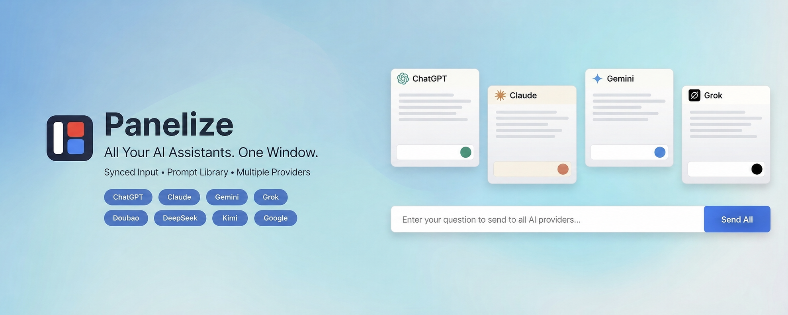
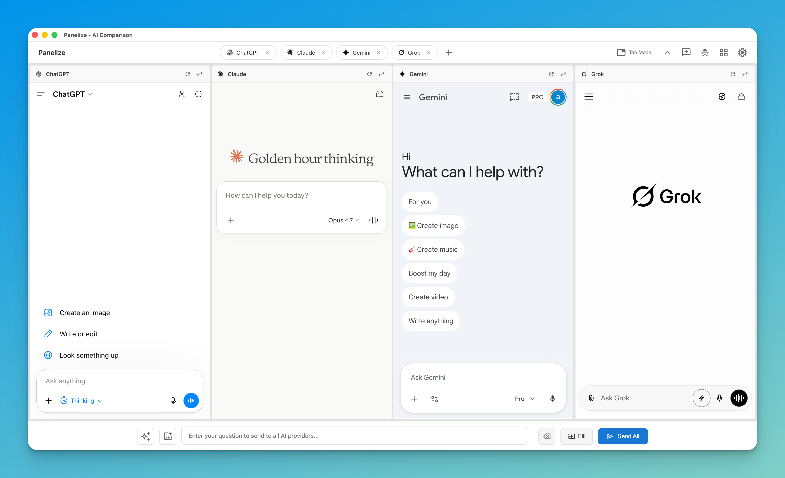
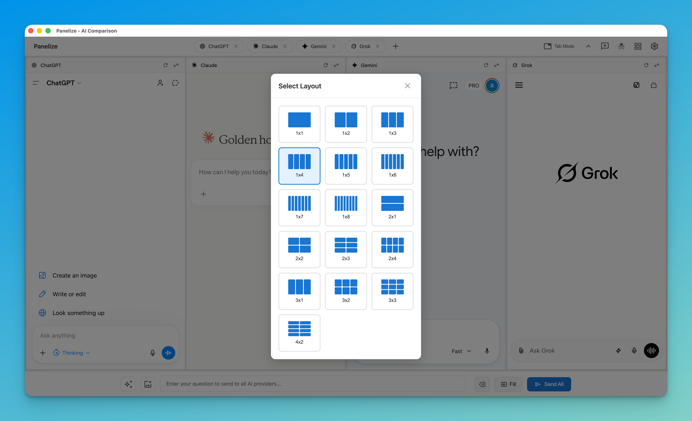
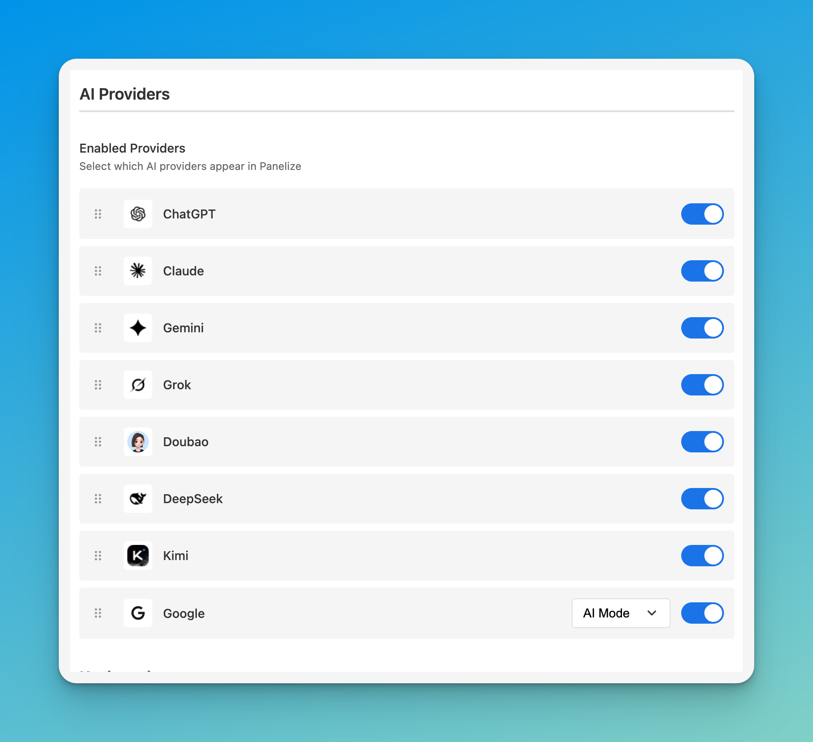

# AIChatMerge

  <a href="README.md"><strong>English</strong></a> |
  <a href="README.zh-CN.md"><strong>简体中文</strong></a> |
  <a href="README.ja.md"><strong>日本語</strong></a>

  

  <strong>Stop switching tabs. Start comparing AI responses side by side.</strong>

  
  
  
  
  

---

## Why AIChatMerge?

Ever found yourself copying the same prompt across multiple AI tabs just to compare answers? AIChatMerge eliminates that workflow entirely.

**One window. One prompt. Multiple AI responses—instantly.**

  

---

## Features at a Glance

### 🎯 Ask Once, Compare All

Type your question once and send it to DeepSeek, Kimi, ChatGPT, and Claude simultaneously. See which AI gives you the best answer—no tab switching required.

### 📐 Flexible Layouts

Choose from 15 different layouts to fit your workflow. Need a quick 2-way comparison? Use 1×2. Deep research across 4 models? Try 1×4. The choice is yours.

  

### ⚡ Zero Setup

No API keys. No configuration. Just log into your AI accounts normally, and AIChatMerge uses those existing sessions. If you can use ChatGPT in a browser tab, you can use it in AIChatMerge.

### 📚 Prompt Library

Save your best prompts and reuse them across all providers. Supports variables like `{topic}` for quick customization.

### 🔒 Privacy First

- One-click privacy mode across supported providers
- All data stays in your browser—nothing leaves your machine
- No tracking, no analytics, no data collection
- Open source—review the code yourself

---

## Supported AI Providers

<table align="center">
  <tr>
    <td align="center"><strong>DeepSeek</strong></td>
    <td align="center"><strong>Kimi</strong></td>
    <td align="center"><strong>ChatGPT</strong></td>
    <td align="center"><strong>Claude</strong></td>
  </tr>
</table>

  

---

## Installation

### Chrome Web Store (Recommended)

1. Visit the [Chrome Web Store](https://chromewebstore.google.com/detail/panelize/iokalaafkmjffolodkkgbbccmofbglii) page
2. Click **"Add to Chrome"**
3. Done! Press `Cmd/Ctrl + Shift + E` to open AIChatMerge

> **Works on Edge too:** Install directly from the Chrome Web Store.

<strong>Manual Installation (for developers)</strong>

1. Download the source code from this repository
2. Go to `chrome://extensions/` (or `edge://extensions/`)
3. Enable "Developer mode"
4. Click "Load unpacked" and select the extracted folder

---

## Quick Start

1. **Log into your AI accounts** — Visit ChatGPT, Claude, etc. and log in as usual
2. **Press `Cmd/Ctrl + Shift + E`** — Opens the AIChatMerge window
3. **Pick a layout** — Choose how many AI panels you want
4. **Type and send** — Your prompt goes to all panels at once

That's it. No accounts to create, no API keys to configure.

---

## Keyboard Shortcuts

| Action | Shortcut |
|--------|----------|
| Open AIChatMerge | `Cmd/Ctrl + Shift + E` |
| Open Prompt Library | `Cmd/Ctrl + Shift + L` |

Customize shortcuts at `chrome://extensions/shortcuts`

---

## Troubleshooting

**AI provider shows login page?**
→ Log into that provider in a regular browser tab first, then refresh AIChatMerge.

**Shortcuts not working?**
→ Check for conflicts at `chrome://extensions/shortcuts`

**Need more help?**
→ [Open an issue](https://github.com/Manho/AIChatMerge/issues)

---

## Contributing

Found a bug? Have an idea? Contributions are welcome:
- 🐛 Report bugs via [GitHub Issues](https://github.com/Manho/AIChatMerge/issues)
- 💡 Suggest features
- 🌍 Help translate to more languages
- 🔧 Submit pull requests

---

## License

MIT License — see [LICENSE](LICENSE) for details.

---

  <strong>Open source & privacy-focused</strong> 
  Available in 10 languages

  Made for everyone who's tired of tab-switching between AI assistants.

