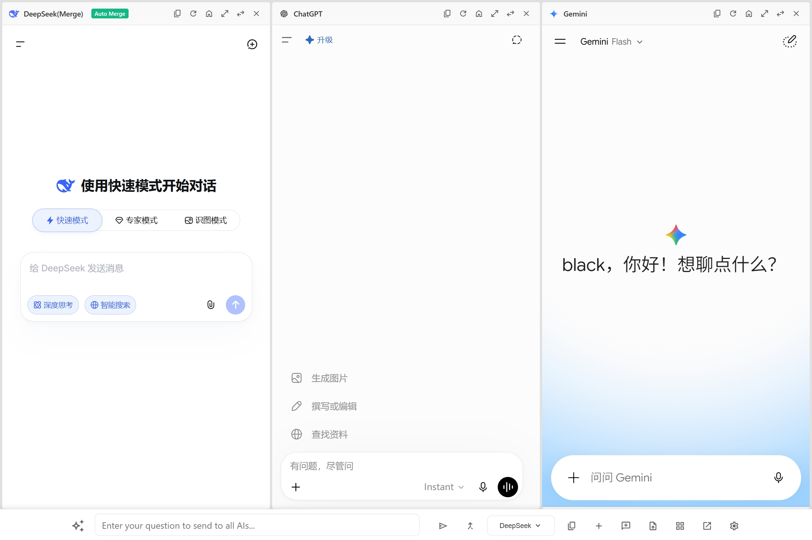
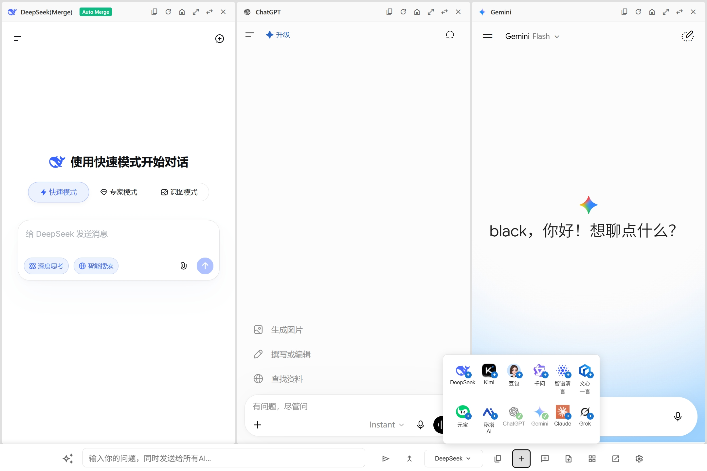
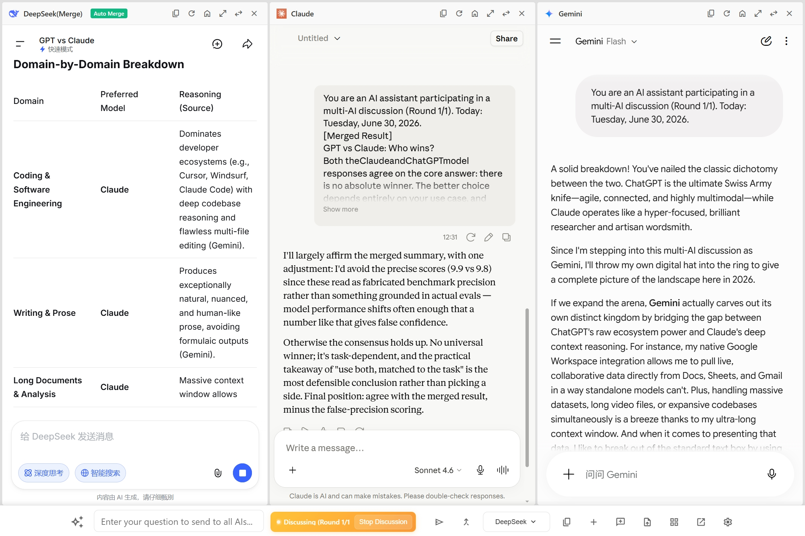
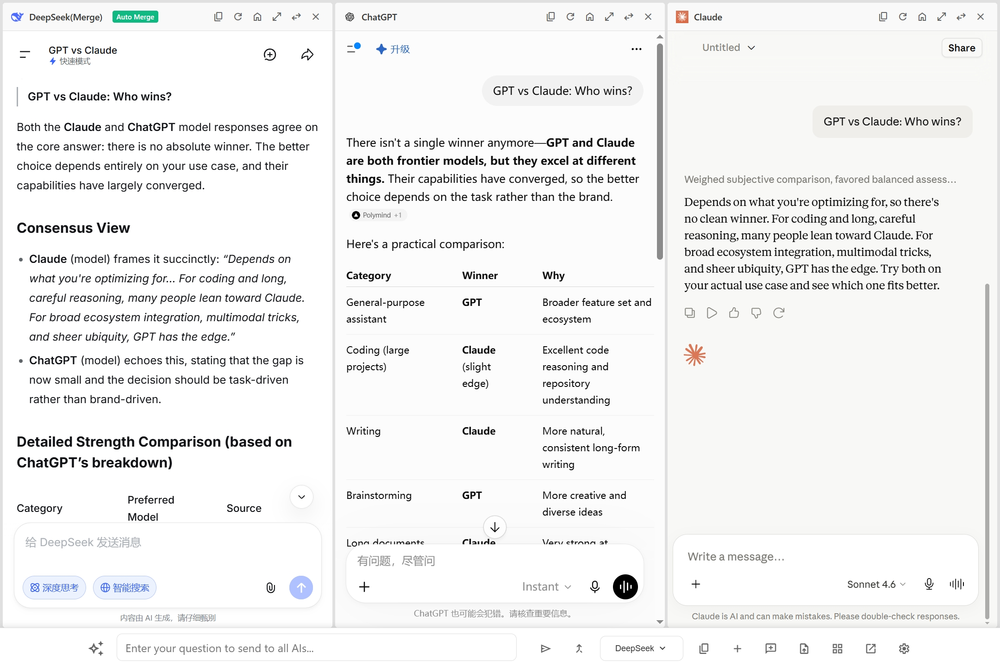

# AIChatMerge

  <a href="README.md"><strong>English</strong></a> |
  <a href="README.zh-CN.md"><strong>简体中文</strong></a>

  

  <strong>告别反复切换标签页，一次提问并排对比多个 AI 回答。</strong>

  
  
  
  
  

---

## 为什么选择 AIChatMerge？

还在把同一个 Prompt 复制到多个 AI 标签页里逐个比较吗？

**AIChatMerge 让你在一个窗口里，一次发送，并排对比多个 AI 的答案，还能自动融合出最佳回答。**

  

---

## 核心功能

### 一次提问，同时对比

在统一输入框中输入一次内容，就能同时发送到已选择的多个 AI 平台。

### 灵活布局

支持 5 种布局（1×1、1×2、1×3、1×4、1×5），快速双模型对比可用 1×2，四模型深入分析可用 1×4。

  

### 零配置

不需要 API Key，也不需要额外账号。你在浏览器里登录过对应平台即可使用。

### 提示词库

可保存常用提示词，并支持 `{topic}` 这类变量占位符，复用更高效。

### 自动融合与讨论

所有平台回答完成后，AIChatMerge 可自动将多个答案融合为一个综合回复。也可以进入讨论模式，继续与任意平台深入探讨。

### Markdown 导出

融合结果或单个对话均可导出为 Markdown 文件，方便分享和存档。

### 隐私优先

- 支持在兼容的平台上一键开启隐私模式
- AIChatMerge 不会把你的数据发送到 AIChatMerge 作者或项目服务器
- 你发送的问题直达所选 AI 平台，各平台按其隐私政策处理数据
- 无追踪、无埋点、无数据上传
- 完全开源，可自行审阅代码

### 开发者友好

- 支持自定义 Claude 入口 URL
- 中英文界面，简洁专注

---

## 支持的 AI 平台

- DeepSeek
- Kimi
- 豆包
- 千问
- 智谱清言
- 文心一言
- 元宝
- 秘塔 AI
- ChatGPT
- Gemini
- Claude
- Grok

  

---

## 安装

<strong>手动安装</strong>

1. 从 GitHub Releases 下载最新版
2. 打开 `chrome://extensions/`（或 `edge://extensions/`）
3. 开启“开发者模式”
4. 点击“加载已解压的扩展程序”，选择项目目录

---

## 快速开始

1. **先登录各平台账号**：先在普通网页标签页登录 ChatGPT / Claude 等
2. **按 `Cmd/Ctrl + Shift + E`**：打开 AIChatMerge
3. **选择布局**：按需求选择面板数量与布局
4. **输入并发送**：一次发送到所有面板

---

## 快捷键

| 操作 | 快捷键 |
|------|--------|
| 打开 AIChatMerge | `Cmd/Ctrl + Shift + E` |
| 打开提示词库 | `Cmd/Ctrl + Shift + L` |

可在 `chrome://extensions/shortcuts` 自定义。

---

## 常见问题

**AI 页面显示登录状态？**
→ 先在普通标签页登录该平台，再刷新 AIChatMerge。

**快捷键无效？**
→ 到 `chrome://extensions/shortcuts` 检查冲突。

**需要帮助？**
→ [提交 Issue](https://github.com/YinDou-AI/AIChatMerge/issues)

---

## 已知限制

- 需要用户自行登录各 AI 平台账号后才能使用。
- 部分 AI 平台可能限制 iframe 嵌入、可用模型、登录状态或存在风控。
- Claude 默认入口异常时，可在高级设置中填写自定义页面 URL。
- 海外 AI 平台（ChatGPT、Gemini、Claude、Grok）可能受网络环境影响。
- 自动融合依赖网页状态检测，极少数情况下可能需要手动融合。

---

## 贡献

欢迎反馈与贡献：

- 🐛 [提交 Bug](https://github.com/YinDou-AI/AIChatMerge/issues)
- 💡 提出功能建议
- 🔧 提交 Pull Request

---

## License

MIT License，详见 [LICENSE](LICENSE)。

### 第三方许可证

本项目包含以下第三方库：

| 库 | 许可证 | 来源 |
|---|--------|------|
| [Readability.js](https://github.com/mozilla/readability) | Apache License 2.0 | Mozilla / Arc90 Inc |

Readability.js 用于 `libs/Readability.js`，从网页中提取正文内容。基于 Apache License 2.0 授权。

### 致谢

AIChatMerge 基于 MIT 许可证开源项目 [Panelize](https://github.com/Manho/Panelize) 开发，感谢原项目及其贡献者。
